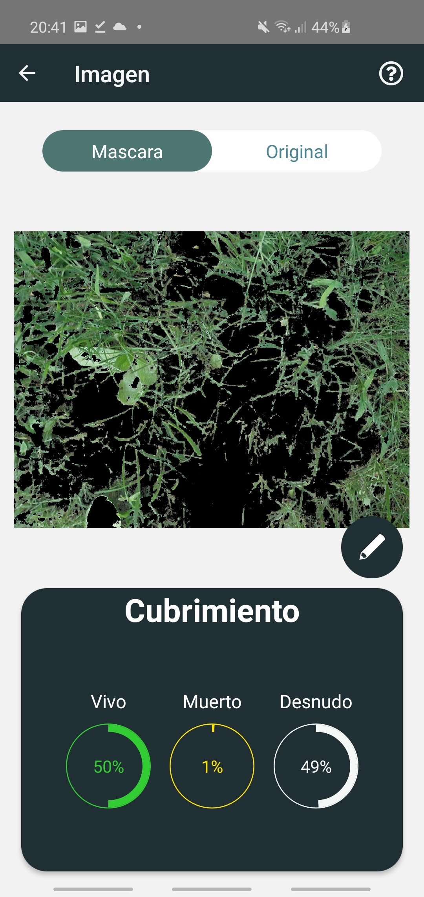
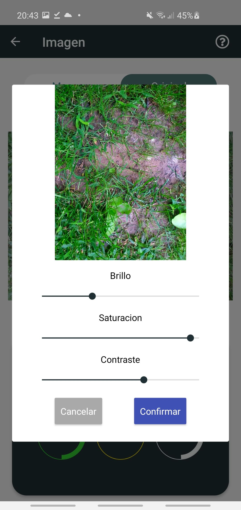
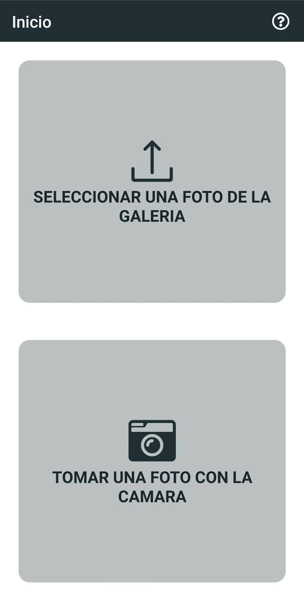

This is an app developed to help the work of INTA (Institiruo Nacional de Tecnologia Agropecuaria). The main funcionality of this app is that user have the hability to upload a photo (via camera or gallery), and the app will process it to check the percentage of green (live vegetation), yellow (dead vegetation) and naked ground that appears in the picture. There is also a more complete version of the app, that adds internet connection. This version lets the user store the images in the cloud, save sessions of analisis and more.

